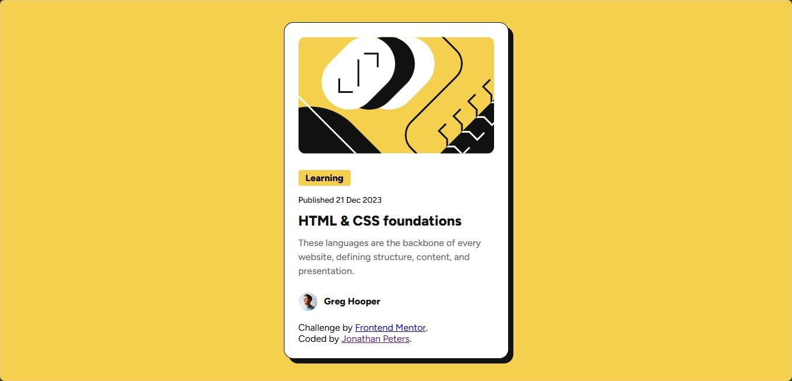
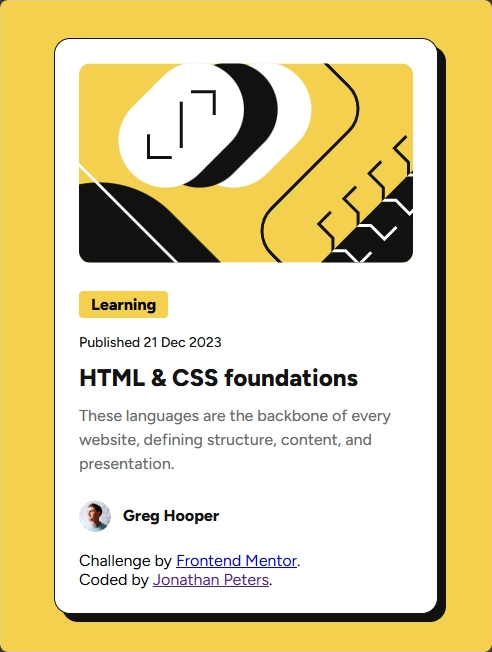

# Frontend Mentor - Blog preview card solution

This is a solution to the Blog preview card challenge on Frontend Mentor. Frontend Mentor challenges help you improve your coding skills by building realistic projects.

Tab

# Overview
## The challenge: 

Users should be able to:
See hover and focus states for all interactive elements on the page


Desktop View:
<a href="#">

</a>


Mobile View:
<a href="#">

</a>


# Links
Solution URL: https://github.com/QMS85/BlogPreviewCard.git
Live Site URL: https://qms85.github.io/BlogPreviewCard/

My process
Built with
Semantic HTML5 markup
CSS custom properties
Flexbox
CSS Grid


# What I learned
Looking at your blog preview card project, there are several impressive aspects worth highlighting:

## 1. Clean and Semantic HTML Structure:
The HTML in index.html is well-organized using semantic elements like ```<main>```, ```<article>```, and appropriate content hierarchy.
This shows good attention to accessibility and SEO practices.

## 2. Sophisticated CSS Hover Effects:
The card hover animation in style.css is particularly elegant:
```
.card:hover {
  box-shadow: 12px 12px 0 var(--gray-950);
  transform: translate(-4px, -4px);
}
```
This creates a smooth, engaging lift effect that enhances user interaction while maintaining simplicity.

## 3. Responsive Design:
The mobile-first approach with a clean media query breakpoint at 375px shows good responsive design practices.

## 4. CSS Custom Properties:
The use of CSS variables (custom properties) for colors makes the code more maintainable and consistent:
```
:root {
  --yellow: hsl(47, 88%, 63%);
  --white: hsl(0, 0%, 100%);
  --gray-500: hsl(0, 0%, 42%);
  --gray-950: hsl(0, 0%, 7%);
}
```

## 5. Performance Optimization:
Using modern image formats (webp) for the avatar image and SVG for illustrations shows consideration for performance.


## Challenges I Faced:

Looking at the blog preview card project, some of the key challenges were:

## 1. Responsive Design Implementation:

The challenge was creating a card that looks good on both mobile (375px) and desktop screens. 
This was solved through:
~ Using relative units and max-width constraints
~ Implementing a clean mobile-first approach
~ Creating appropriate breakpoints in the media queries
~ Interactive States

Implementing smooth hover animations was tricky but effectively achieved with:
```
.card:hover {
  box-shadow: 12px 12px 0 var(--gray-950);
  transform: translate(-4px, -4px);
}
```
This creates an elegant lift effect without disrupting the layout.

## 2. Font Management

~ Handling custom fonts required careful implementation:
~ Using variable fonts for flexibility
~ Ensuring proper font-weight distribution
~ Managing font loading performance

## 3. Accessibility Considerations

The project required attention to:
~ Semantic HTML structure
~ Proper color contrast ratios
~ Interactive element states

## 4. CSS Custom Properties

Setting up a maintainable color system using CSS variables required planning but provided consistency:
```
:root {
  --yellow: hsl(47, 88%, 63%);
  --white: hsl(0, 0%, 100%);
  --gray-500: hsl(0, 0%, 42%);
  --gray-950: hsl(0, 0%, 7%);
}
```

# Continued development:

Advanced CSS, Javascript integration, Web Accessibility, Performance optimisation & testing

Author: Jonathan Peters
Website: https://qms85.github.io/MyPortfolio/
Frontend Mentor: https://www.frontendmentor.io/profile/QMS85
Twitter - @yDJJOnnas85
Facebook: https://www.facebook.com/2jonathanpeters 
Linkedin: https://www.linkedin/in/2jonathanpeters

